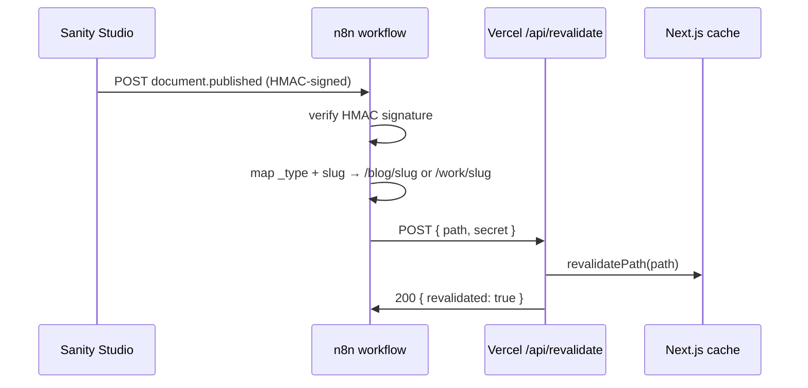

# Good vs. bad exemplar

A strong `plan.mdx` earns sign-off before a single line of code changes. It opens with the outcome in plain English, commits to the hard-to-reverse bets early, names real files and symbols, and uses components only where they beat a paragraph. Every open question lives in one block at the bottom with a recommended default. The plan stands alone: a reviewer who was not in the chat understands the design, the constraints, and what is still open before they reach the first diagram.

The worked example below uses this scenario: **add a Sanity `document.published` webhook that triggers n8n, which calls Vercel's on-demand ISR revalidation endpoint, so published content reaches visitors without a full redeploy.**

---

## Worked `plan.mdx` — Sanity → n8n → Vercel ISR revalidation

```mdx
---
title: Sanity publish webhook → Vercel ISR revalidation
status: draft
owner: jane@example.com
created: 2026-06-25
repo: your-org/example-site
related:
  - "[[example-site.com PRD]]"
  - "[[_Clients-Wiki]]"
tags: [plan, visual-plan, example-site, sanity, vercel, isr]
---

## Outcome

When a Sanity editor publishes a document, visitors see the updated content within
seconds — no Vercel redeploy, no stale ISR cache window. The hook fires on
`document.published`, n8n validates the payload and resolves the Next.js path,
then calls Vercel's `/api/revalidate` route with a shared secret. This replaces
the current five-minute `revalidate: 300` stale window on blog and project pages.

In scope: `post` and `project` document types, the `/blog/[slug]` and
`/work/[slug]` routes. Deferred: tag/category pages, draft-mode preview, and
incremental revalidation of the sitemap.

## Approach

The work touches three systems. Within the Next.js app the only new file is a
server route — everything else reuses the existing `sanityFetch` helper and the
Next.js `revalidatePath` built-in. In n8n a new workflow handles the Sanity
webhook payload, validates the HMAC signature, maps `_type` + `slug.current`
to a Next.js path, then POSTs to the revalidation route. In Sanity a webhook is
registered pointing at the n8n production webhook URL.

Reuse first: `lib/sanity/client.ts` already exports `projectId` and `dataset`
constants — the n8n workflow reads these from an existing credential store, so
no new secrets enter the code. `app/blog/[slug]/page.tsx` and
`app/work/[slug]/page.tsx` already call `revalidatePath` implicitly through
Next.js ISR; the new route calls it explicitly on demand, replacing the static
`revalidate` export only where it conflicts.

<Decision title="Revalidation scope: path vs. tag" status="decided">
Chosen: `revalidatePath('/blog/' + slug)` and `revalidatePath('/work/' + slug)`.

Rejected: `revalidateTag(documentId)` — requires tagging every `fetch` call
in existing pages with a matching cache tag, which touches six files and creates
a new convention to enforce. Path-scoped revalidation costs one extra pass on
the layout but requires no changes to existing fetch calls.

Forecloses: moving to tag-based cache invalidation later will require that
tagging work anyway. This approach does not block it — it just defers it.
</Decision>

<Diagram title="Publish pipeline" caption="Sanity fires once per publish; n8n is the only system that holds the revalidation secret.">

</Diagram>

<FileMap root="example-site/">
- **add** `app/api/revalidate/route.ts` — POST handler; validates bearer secret, calls revalidatePath
- **edit** `app/blog/[slug]/page.tsx` — remove static `export const revalidate = 300`
- **edit** `app/work/[slug]/page.tsx` — remove static `export const revalidate = 300`
- **read-only** `lib/sanity/client.ts` — exports projectId/dataset reused in n8n credential
- **add** `n8n/workflows/sanity-isr-revalidate.json` — exported n8n workflow definition
</FileMap>

<ApiEndpoint method="POST" path="/api/revalidate" auth="Bearer REVALIDATE_SECRET">
Request body:

```json
{ "path": "/blog/my-post-slug" }
```

Success response (200):

```json
{ "revalidated": true, "path": "/blog/my-post-slug" }
```

Error responses: 401 if secret missing or wrong; 400 if `path` is absent or
does not begin with `/blog/` or `/work/`; 500 on a Next.js revalidation failure.
The route must not accept an empty or root path — `revalidatePath('/')` would
flush the entire cache.
</ApiEndpoint>

<DataModel name="Sanity webhook payload (inbound to n8n)" store="sanity">

| Field | Type | Notes |
|---|---|---|
| `_type` | `string` | `"post"` or `"project"` — used to pick the route prefix |
| `_id` | `string` | Sanity document id — logged for tracing; not sent to Vercel |
| `slug.current` | `string` | URL-safe slug; appended to route prefix |
| `_rev` | `string` | Revision id — used as idempotency key in n8n |

The `_rev` field is the idempotency key: if n8n receives the same revision
twice (e.g. a Sanity retry), the workflow skips the Vercel call and returns 200.
</DataModel>

<AnnotatedCode file="app/api/revalidate/route.ts" lang="typescript">
```typescript
import { revalidatePath } from 'next/cache'
import { NextRequest, NextResponse } from 'next/server'

const ALLOWED_PREFIXES = ['/blog/', '/work/']  // >> whitelist: prevents full-cache flush

export async function POST(req: NextRequest) {
  const auth = req.headers.get('authorization') ?? ''
  if (auth !== `Bearer ${process.env.REVALIDATE_SECRET}`) {  // >> constant-time compare preferred; swap for timingSafeEqual in prod
    return NextResponse.json({ error: 'unauthorized' }, { status: 401 })
  }

  const { path } = await req.json()
  if (!path || !ALLOWED_PREFIXES.some(p => path.startsWith(p))) {  // >> guard: empty path or '/' would flush everything
    return NextResponse.json({ error: 'invalid path' }, { status: 400 })
  }

  revalidatePath(path)
  return NextResponse.json({ revalidated: true, path })
}
```
</AnnotatedCode>

## Verification

Smoke test: publish a `post` document in Sanity Studio (staging), confirm n8n
workflow run succeeds in the execution log, then `curl -I` the `/blog/<slug>`
page and inspect the `x-nextjs-cache` header — it should flip from `HIT` to
`MISS` then back to `HIT` within ten seconds.

Failure path: if n8n cannot reach the Vercel URL (network error, wrong secret),
the n8n workflow logs the error and retries twice. The page stays stale but does
not error; the next ISR pass (we will set a long fallback `revalidate: 3600`)
catches it.

<OpenQuestions>
- **Q:** Should the route accept a `tag` param alongside `path` for future tag-based invalidation? — *Recommended:* No — keep the first cut path-only; add the tag branch when we do the tagging work. — *Blocks:* nothing; purely additive later.
- **Q:** Should n8n verify the Sanity HMAC with the webhook secret, or is a shared URL secret sufficient for now? — *Recommended:* HMAC verification — Sanity provides it for free and the n8n HTTP-request node can compute it; adds maybe 10 min of setup. — *Blocks:* n8n workflow spec; must be decided before the webhook is registered in Sanity.
- **Q:** Fallback `revalidate` value for the blog and work routes after removing `revalidate: 300`? — *Recommended:* `revalidate: 3600` (1 hour) so stale content still clears if the webhook ever fails silently. — *Blocks:* the edit to `app/blog/[slug]/page.tsx` and `app/work/[slug]/page.tsx`.
</OpenQuestions>
```

---

## Anti-patterns to avoid

**Wall of prose, no components.** A plan that describes the data model in a paragraph, the file changes in another paragraph, and the API contract in a third gives reviewers nothing to anchor on. If the information is structural — a table of fields, a list of files with actions, a method/path/auth tuple — put it in the matching component. Prose carries the reasoning; components carry the facts.

**Components with no prose.** The opposite failure: a sequence of blocks with no connective tissue. A `<FileMap>` that appears with no sentence explaining why those files change, a `<Decision>` with no paragraph situating the tradeoff, a `<Diagram>` with no caption — these leave the reviewer doing interpretation work the author should have done. Every component needs at least one sentence of prose around it.

**Open questions scattered through the body.** One `<OpenQuestions>` block, at the bottom, always. An open question buried in a `<Decision>` body, a footnote in a `<DataModel>`, or a parenthetical in the approach section will be missed and never resolved. If it is genuinely unresolved, it goes in the bottom block with a recommended default and a "Blocks:" note.

**Forcing a top canvas onto a backend-only plan.** The ISR revalidation plan above has no `<Canvas>` or `<Wireframe>` because the feature has no new UI. A `<Canvas>` showing "Sanity Studio → n8n → Vercel" as labeled boxes with arrows is an architecture diagram, not a product wireframe, and the `<Diagram>` component handles it better. Reserve `<Canvas>`/`<Screen>` for actual product UI surfaces — screens that look like the real app. Never force visual chrome onto a plan that does not need it.

**A menu of options where the plan should commit.** A `<Decision>` block that lists three approaches and says "we could do A, B, or C" has not made a decision. The block must name the chosen option, explain why, reject the alternatives with reasons, and state what the choice forecloses. The plan is the approval gate; the reviewer should be confirming a direction, not picking from a menu.

**Single-step or padded plans.** A plan with one `<FileMap>` entry and no `<Decision>` or `<Diagram>` needed should probably be a chat message, not a `plan.mdx`. Conversely, adding a `<Diagram>` that shows `A → B` when the prose already said "A calls B" is padding. Add a component only when it carries information the prose does not.

**Raw hex instead of `--wf-*` tokens in wireframes.** Any `<Wireframe>` or `<Screen>` that uses `#1a1a2e`, `color: rgb(...)`, or a hard-coded `background-color` will break in dark mode and drift from the design system. Use only the 12 canonical tokens — `--wf-paper`, `--wf-card`, `--wf-ink`, `--wf-muted`, `--wf-line`, `--wf-accent`, `--wf-accent-fg`, `--wf-accent-soft`, `--wf-ok`, `--wf-warn`, `--wf-danger`, `--wf-radius` — plus the helper classes (`.wf-card`, `.wf-row`, `.wf-bar`, `.wf-pill`, `.wf-muted`, `button.primary`) defined in `references/wireframe.md`. There are no spacing or text-size tokens (`--wf-space-*`, `--wf-text-*` do not exist) — lay out with ordinary CSS. Use only the 8 surfaces: `browser`, `desktop`, `tablet`, `mobile`, `email`, `modal`, `panel`, `popover`. The renderer supplies the theme; the wireframe supplies the structure.

**Revision language.** The plan is a standalone proposal. Phrases like "unlike our previous approach," "as discussed earlier," or "this replaces what I suggested in the last message" make the plan dependent on a chat thread that the reviewer may not have. Write as if the plan is the first time this proposal has been stated. Carry the relevant facts forward cleanly.

**Inventing files or symbols.** Every path in a `<FileMap>`, every field in a `<DataModel>`, every import in an `<AnnotatedCode>` block must come from reading the actual codebase — not from what a Next.js or Sanity project typically looks like. If you have not read `lib/sanity/client.ts`, do not assert it exports `projectId`. Mark anything inferred as inferred. Research before drafting.

**Any dependency on a hosted plan service.** `plan.mdx` renders in our own Next.js viewer (`templates/plan-route.tsx` + `templates/mdx-components.tsx`) and degrades to readable Markdown in Obsidian. There is no external plan URL, no `@agent-native` connector, no localhost bridge, and no BuilderIO tooling in the runtime. The format is ours. Do not add imports, runtime dependencies, or references to any hosted plan product.
