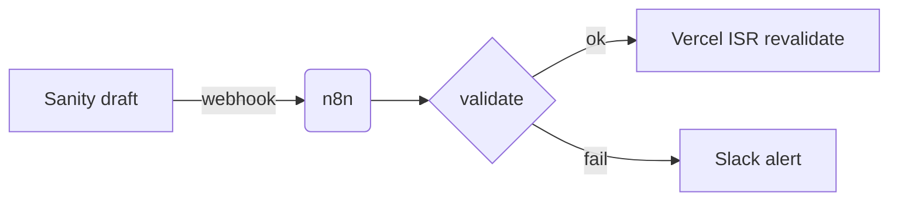
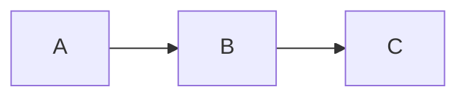

# The Rhize Plan Format (`plan.mdx`)

The single source of truth for the **Rhize-owned** visual-plan format. It is plain MDX: a Markdown
document with a small set of Rhize components. It renders rich in our Next.js viewer and degrades to
readable Markdown (with native Mermaid) in Obsidian. **No external plan service or `@agent-native`
dependency** — we own every component in `templates/mdx-components.tsx`.

Design rules:

- **Prose-first.** Components punctuate the prose where a picture or contract beats a paragraph. A plan
  that is all components and no prose has failed.
- **One file.** A plan is one `plan.mdx`. Canvas artboards live inline in `<Canvas>`; there is no
  separate `canvas.mdx`/`prototype.mdx` split (that was BuilderIO's runtime model — not ours).
- **Degrade gracefully.** Every component must read sensibly as Markdown if the renderer is absent, so a
  vault reader still gets the plan. Put a human-readable child (caption, list, or fenced code) inside
  each component, never an opaque prop-only tag.

---

## Frontmatter

```yaml
---
title: <Plan title>
status: draft            # draft | in-review | approved | superseded
owner: jane@example.com
created: 2026-06-25
repo: <github org/repo or "n/a">
related:                 # Obsidian wikilinks — connect to the project MOC + codebase registry
  - "[[_<Client>]]"
  - "[[<Project> PRD]]"
tags: [plan, visual-plan, <project>]
---
```

`status` is the approval-gate state. Flip to `approved` only after explicit sign-off; mark old plans
`superseded` rather than deleting (vault history). These keys render as Obsidian Properties and as a
header chip in the Next.js viewer.

---

## Components

Each entry: purpose · props · render behavior · Markdown degradation. Author the human-readable child
content even when props carry the data.

### `<Diagram>` — relationships & flow
- **Purpose:** architecture, data flow, sequence, state — anything spatial. Backend mechanics and
  meta-explanations go here, NOT in a UI canvas.
- **Props:** `title`, `caption?`.
- **Body:** a fenced ```mermaid block.
- **Render:** Mermaid → SVG. **Degrades:** Obsidian renders the Mermaid natively.

```mdx
<Diagram title="Publish pipeline">

</Diagram>
```

### `<FileMap>` — what changes where
- **Purpose:** the file plan; name real paths and the verb (add/edit/delete) + the new delta.
- **Props:** `root?`.
- **Body:** a Markdown list, one item per file. Mark the verb with a leading bold tag —
  `**add**` / `**edit**` / `**delete**` — then the `` `path` `` and an em-dash note.
- **Render:** list with the leading verb tinted (add=green, edit=blue, delete=red). The bold
  verb is optional — an item with no recognized verb still renders cleanly. **Degrades:** plain list.

```mdx
<FileMap root="app/">
- **add** `app/plans/[slug]/page.tsx` — server route, reads plan.mdx
- **edit** `lib/mdx-components.tsx` — register plan components
</FileMap>
```

### `<DataModel>` — schema/table shape
- **Purpose:** a hard-to-reverse data decision (Sanity doc type, Supabase table, TS type).
- **Props:** `name`, `store?` (`sanity|payload|supabase|type`).
- **Body:** a Markdown table (field · type · notes) or a fenced type/SQL block.
- **Render:** field table with the store badge. **Degrades:** table/code as written.

### `<ApiEndpoint>` — contract
- **Purpose:** an API/route/server-action contract — wire format and public ids are expensive to undo.
- **Props:** `method`, `path`, `auth?`.
- **Body:** request/response shape (fenced JSON/TS) + notes.
- **Render:** method-colored contract card. **Degrades:** heading + code.

### `<Wireframe>` / `<Screen>` — a single UI screen
- **Purpose:** one product screen at real density. **`references/wireframe.md` is the authority** for
  the full quality bar AND the exact token / surface / helper-class vocabulary — do not redefine it here.
- **Props:** `surface` (one of the presets in wireframe.md), `title`, `state?`
  (`default | empty | loading | error`).
- **Body:** a semantic HTML fragment using the `--wf-*` tokens and helper classes from wireframe.md
  (no `<html>/<style>/font` tags; no spacing/text tokens — those do not exist). Author it as inline
  HTML — the renderer serializes the parsed element tree back to real HTML, preserving every `class`
  and `style`. If the HTML must contain JSX-hostile characters (`{` or `}`), wrap the body in a fenced
  code block tagged `html` instead and the renderer uses its raw contents verbatim.
- **Render:** inline, auto-scaled HTML in a scoped device frame (`.rp-wf-doc` — not an iframe, so it
  survives Obsidian's CSP). **Degrades:** the HTML renders inline in Obsidian, or as a labeled code block.

### `<Canvas>` — multi-artboard static UI
- **Purpose:** a flow/storyboard/journey: one `<Screen>` artboard per user-visible state. UI-first.
- **Props:** `title`, `lanes?`.
- **Body:** multiple `<Screen>` children (each using the `surface`/token vocabulary in
  `references/wireframe.md`) + plain-text `<Annotation target="..." placement="...">` notes.
- **Render:** artboards laid out in lanes with annotations. **Degrades:** stacked screens.
- **Export:** maps to an Obsidian `.canvas` via `obsidian-second-brain:json-canvas`.

### `<Decision>` — a hard-to-reverse bet
- **Purpose:** call out a decision that is expensive to undo, with the chosen option + rationale +
  what it forecloses.
- **Props:** `title`, `status?` (`decided|open`).
- **Body:** chosen option, why, alternatives rejected, blast radius.
- **Render:** callout box. **Degrades:** blockquote-style section.

### `<Diff>` / `<AnnotatedCode>` — code review surface
- **Purpose:** show a concrete change or annotate real code. These are the only blocks allowed to
  break wider than prose.
- **Props:** `file`, `lang?`.
- **Body:** a fenced ```diff (`<Diff>`) or fenced code with trailing `// >> note` annotations
  (`<AnnotatedCode>`).
- **Render:** syntax-highlighted diff / gutter annotations. **Degrades:** fenced code.

### `<OpenQuestions>` — the single bottom block
- **Purpose:** exactly ONE per plan, at the bottom. Every unresolved decision with a recommended default.
- **Props:** none.
- **Body:** a Markdown list: `**Q:** … — *Recommended:* … — *Blocks:* <what it gates>`.
- **Render:** question form. **Degrades:** list. Never scatter open questions through the body.

---

## Minimal skeleton

```mdx
---
title: Example Plan
status: draft
owner: jane@example.com
created: 2026-06-25
repo: your-org/example
related: ["[[Example PRD]]"]
tags: [plan, visual-plan]
---

## Outcome
One paragraph: what's true after this ships, and why now.

## Approach
Prose. Lead with reuse, then the new delta.

<Decision title="Wire format" status="decided">
Use ULID public ids. Rejected auto-increment (leaks volume) and UUIDv4 (unsortable). Locks the API
contract below.
</Decision>

<FileMap>
- **add** `app/plans/[slug]/page.tsx` — render route
</FileMap>

<Diagram title="Data flow">

</Diagram>

## Verification
How we'll know it worked.

<OpenQuestions>
- **Q:** Public or org-scoped plans by default? — *Recommended:* org-scoped — *Blocks:* the route's auth check.
</OpenQuestions>
```

---

## Authoring rules

1. Outcome-first: open with what's true after this ships, before architecture.
2. Prose carries the plan; components punctuate it.
3. Name real files/symbols/schemas; mark anything inferred as inferred.
4. One spatial `<Diagram>` per decision — not a wall of diagrams.
5. Exactly one `<OpenQuestions>`, at the bottom, each with a recommended default.
6. Keep wide layout to `<Diff>`/`<AnnotatedCode>` only; everything else flows at prose width.
7. The file must read correctly in Obsidian with the renderer absent.
