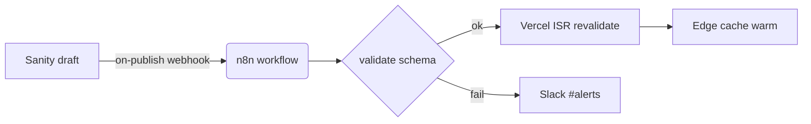

## Outcome

One sentence: what is true after this ships, and why it matters now. Keep this concrete — not "we
improved the system" but "users can publish a Sanity draft and see it on the Vercel preview URL within
30 seconds without touching the terminal."

## Approach

Lead with reuse: what this change builds on (existing routes, actions, schema, helpers) before what it
adds. The delta is what the plan is actually about.

<Decision title="Wire format for plan IDs" status="decided">
Use ULID public IDs (e.g. `01J3Z...`) via the `ulid` package. Rejected auto-increment (leaks volume
to clients) and UUIDv4 (not lexicographically sortable, breaks paginated queries). This locks the
`/api/plans/[id]` route signature shown below.
</Decision>

<FileMap root="app/">
- **add** `app/plans/[slug]/page.tsx` — server-component route that reads plan.mdx and renders it
- **add** `lib/plan-components.tsx` — copy of templates/mdx-components.tsx (see npm installs below)
- **add** `lib/plans.ts` — utility that resolves slug → file path and parses frontmatter
- **edit** `next.config.ts` — add transpilePackages for next-mdx-remote if needed
</FileMap>

<Diagram title="Publish pipeline">

</Diagram>

<DataModel name="Plan" store="supabase">
| Field | Type | Notes |
|---|---|---|
| id | ulid (text) | public PK, generated on insert |
| slug | text | unique, URL-safe |
| title | text | from frontmatter |
| status | text | draft \| in-review \| approved \| superseded |
| owner | text | email |
| created_at | timestamptz | default now() |
| file_path | text | vault or repo relative path to plan.mdx |
</DataModel>

<ApiEndpoint method="GET" path="/api/plans/[slug]" auth="session">
Request: none (slug from path param)

```ts
// Response 200
type PlanResponse = {
  slug: string;
  title: string;
  status: "draft" | "in-review" | "approved" | "superseded";
  owner: string;
  created: string; // ISO date
};

// Response 404 — plan not found
{ error: "not_found" }
```
</ApiEndpoint>

## UI Screens

<Canvas title="Plan viewer flow" lanes="auth,viewer">
<Screen surface="desktop" title="Plan list (empty state)" state="empty">
<div style="display:flex;flex-direction:column;height:100%">
  <div class="wf-bar">
    <strong>Plans</strong>
  </div>
  <div style="flex:1;display:flex;flex-direction:column;align-items:center;justify-content:center;gap:12px;padding:24px;text-align:center">
    <p class="wf-muted">No plans yet. Create your first plan.mdx in the vault.</p>
    <a href="#"><button class="primary">Open docs</button></a>
  </div>
</div>
</Screen>

<Screen surface="desktop" title="Plan viewer (approved)" state="default">
<div style="display:flex;flex-direction:column;height:100%">
  <div class="wf-bar">
    <strong>Plans</strong>
    <span class="wf-muted">/</span>
    <span class="wf-muted">example-plan</span>
  </div>
  <div class="wf-row" style="padding:12px 16px;border-bottom:1px solid var(--wf-line)">
    <span class="wf-pill" style="background:var(--wf-ok);color:var(--wf-accent-fg)">approved</span>
    <small>jane@example.com · 2026-06-25</small>
  </div>
  <main style="padding:20px;max-width:720px">
    <h1>Example Visual Plan</h1>
    <p class="wf-muted">Plan body renders here…</p>
  </main>
</div>
</Screen>

<Annotation target="Plan viewer (approved)" placement="right">
Status chip color: green=approved, yellow=in-review, gray=draft, red=superseded.
Owner + created render from frontmatter; no separate API call needed.
</Annotation>
</Canvas>

<Diff file="app/plans/[slug]/page.tsx" lang="tsx">
```diff
+ import { compileMDX } from "next-mdx-remote/rsc";
+ import { planComponents } from "@/lib/plan-components";
+ import { resolvePlanPath, parsePlanFrontmatter } from "@/lib/plans";
+ import { notFound } from "next/navigation";
+ import { readFile } from "fs/promises";
+
+ export default async function PlanPage({ params }: { params: Promise<{ slug: string }> }) {
+   const { slug } = await params;
+   const filePath = resolvePlanPath(slug);
+   let source: string;
+   try { source = await readFile(filePath, "utf8"); }
+   catch { notFound(); }
+   const { content } = await compileMDX({ source, components: planComponents, options: { parseFrontmatter: true } });
+   return <main>{content}</main>;
+ }
```
</Diff>

<AnnotatedCode file="lib/plans.ts" lang="ts">
```ts
import path from "path";

const PLAN_ROOT = process.env.PLAN_ROOT ?? path.join(process.cwd(), "plans"); // >> configurable via env

export function resolvePlanPath(slug: string): string {
  return path.join(PLAN_ROOT, slug, "plan.mdx"); // >> one file per slug dir
}
```
</AnnotatedCode>

## Verification

How we'll know this shipped correctly:

1. `GET /plans/example-plan` returns 200 and renders the frontmatter chip.
2. `GET /plans/does-not-exist` returns 404 (Next.js not-found page).
3. Mermaid diagram renders as SVG (no layout shift after hydration).
4. `<Wireframe>` HTML is isolated — outer page styles do not bleed in.

<OpenQuestions>
- **Q:** Should plan files live in the vault (`~/Library/Mobile Documents/…`) or the repo (`plans/`)? — *Recommended:* support both via `PLAN_ROOT` env var, default to `plans/` in the repo for simpler CI — *Blocks:* `resolvePlanPath` implementation and `plan-route.tsx` comment block.
- **Q:** Do we need auth on the `/plans/[slug]` route for draft plans? — *Recommended:* gate on Supabase session for `status !== "approved"` — *Blocks:* the `auth?` prop on `<ApiEndpoint>` above.
</OpenQuestions>
